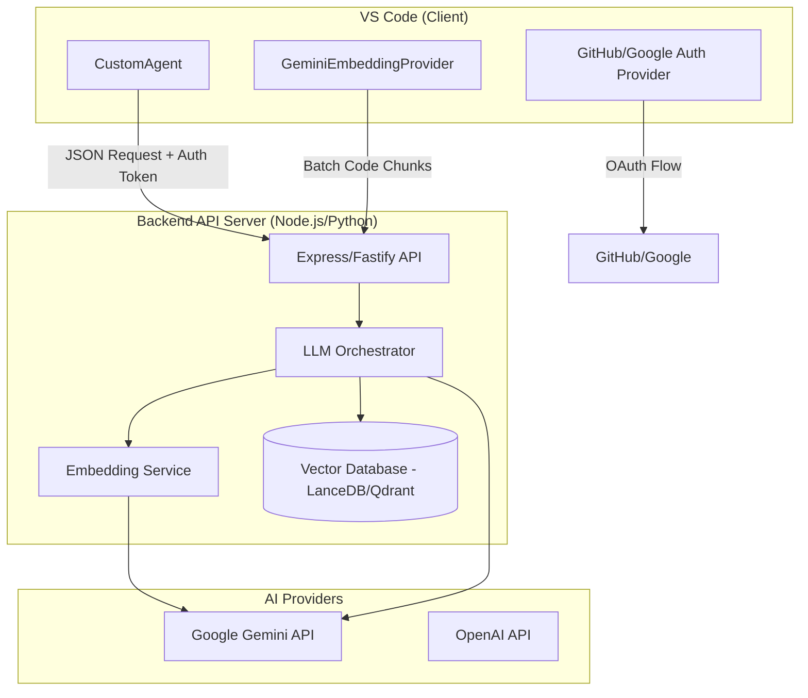

# Professional AI Architecture: IDE + Backend

## Overview
Transitioning from a client-side API key model to a centralized backend architecture. This ensures security (keys never leave the server), scalability (centralized vector DB), and a premium user experience (OAuth login).

## System Architecture

## Proposed Changes

### 1. Backend Service (NEW)
Create a new project `ai-backend` to handle:
- **Authentication**: Validating JWT/OAuth tokens from the IDE.
- **Indexing**: Receiving code chunks and storing them in a Vector DB (LanceDB).
- **Search**: Performing semantic search across indexed code.
- **Inference**: Calling Gemini/OpenAI using server-side environment variables.

### 2. VS Code IDE Modernization
- **Authentication**: Integrate with VS Code's built-in Authentication Provider (GitHub).
- **CustomAgent**: Update to call `POST https://my-backend.com/ai/query` with an `Authorization` header.
- **Embedding Provider**: Update to call `POST https://my-backend.com/index` instead of calling Gemini directly.

### 3. Security & Scalability
- **Rate Limiting**: Implemented on the server.
- **Project Isolation**: Data segmented by `projectId` (GitHub Repo URL).
- **No Client Keys**: Remove `chat.gemini.apiKey` from settings entirely.

## Implementation Phases

### Phase 1: Backend Infrastructure
- [ ] Initialize Express/Node.js backend.
- [ ] Set up LanceDB for local vector storage.
- [ ] Implement Gemini REST calls on the server.

### Phase 2: IDE Client Update
- [ ] Implement GitHub Auth in the IDE.
- [ ] Refactor `CustomAgent.ts` to call backend.
- [ ] Refactor `GeminiEmbeddingProvider.ts` to call backend.

### Phase 3: Deployment & Polish
- [ ] Dockerize backend.
- [ ] Documentation for server-side `.env` setup.

## Technical Details

### API Design (Draft)
- `POST /v1/chat/completions`: Follows OpenAI-compatible spec but routes through backend.
- `POST /v1/index`: Accepts batches of code chunks.
- `GET /v1/search`: Returns relevant context for a query.
